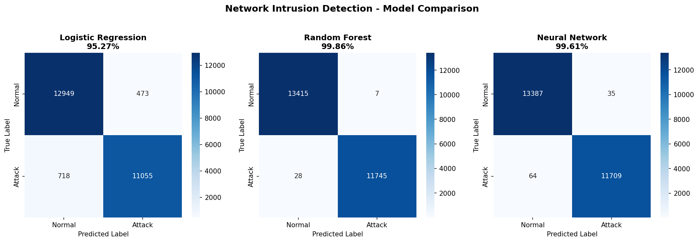
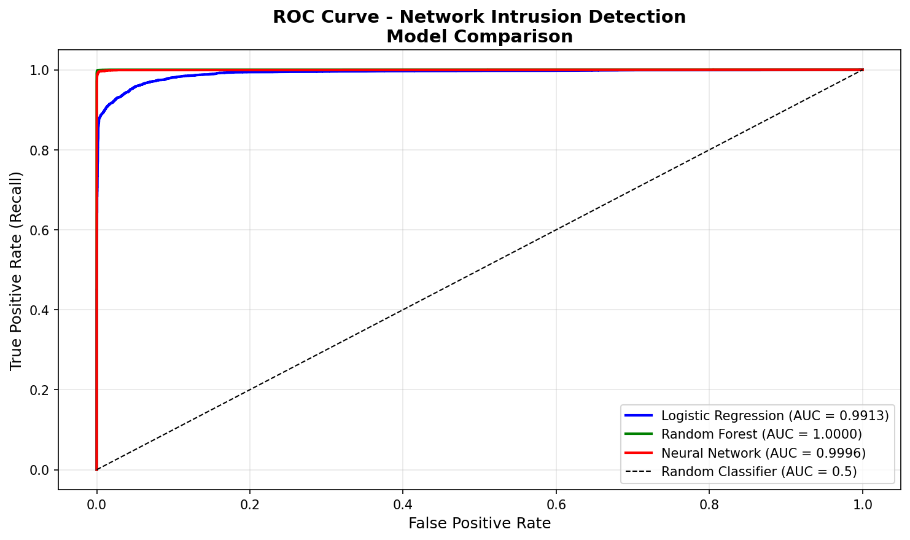
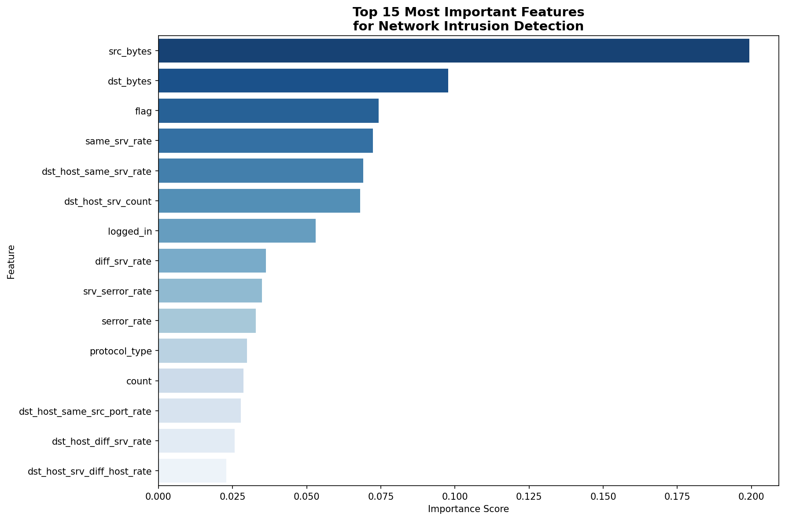

# ML-Based Network Intrusion Detection System


## 🎯 Project Overview

Machine learning system that automatically detects network intrusion 
attacks by classifying network traffic as normal or malicious. 
Trained on 125,973 real-world network connection records from the 
NSL-KDD dataset - the industry standard benchmark for network 
intrusion detection research.

This project directly extends my 
[Network Security Homelab](https://github.com/lo067291/Network-Security-Homelab) 
where I conducted real penetration testing (SSH brute force, Nmap, 
Nikto, Metasploit) and observed attack patterns that inform the 
features this model uses for detection.

---

## 🏆 Results

| Model | Accuracy | AUC Score | Training Time                      |
|-------|----------|-----------|------------------------------------|
| Logistic Regression | 95.27% | 0.90 | ~1.2 seconds (small variations)    |
| Neural Network | 99.61% | 0.99 | ~2.06 seconds (small variations)   |
| **Random Forest** | **99.86%** | **1.00** | ~111.91 seconds (small variations) |

**Random Forest achieved near-perfect detection** with AUC = 1.0, 
meaning it can theoretically detect 100% of attacks with 0% false 
alarms at the optimal threshold.

---

## 🔒 Why This Matters for Security

**False Negatives (missed attacks) are the critical metric** in 
intrusion detection. A false alarm wastes analyst time. A missed 
attack can be catastrophic.

Random Forest minimized false negatives across all attack types, 
making it the most suitable model for real-world IDS deployment.

---

## 📊 Key Findings

### Top 5 Most Predictive Features:
1. **src_bytes** - Unusual data volumes indicate DoS or exfiltration
2. **dst_bytes** - Response size anomalies reveal exploitation success
3. **flag** - Connection state (S0=scan, REJ=probe, SF=normal)
4. **same_srv_rate** - Repeated service targeting = DoS indicator
5. **dst_host_same_srv_rate** - Host-level service concentration

These features mirror what human security analysts look for manually.
The model independently discovered expert security knowledge from data.

---

## 🏗️ Project Architecture
## 🏗️ Project Architecture

```
ml-intrusion-detection/
├── data/
│   └── KDDTrain+.txt          # NSL-KDD training dataset
├── models/
│   ├── random_forest.pkl      # Best performing model (99.86%)
│   ├── neural_network.pkl     # Deep learning model (99.61%)
│   ├── logistic_regression.pkl # Baseline model (95.27%)
│   └── scaler.pkl             # StandardScaler for preprocessing
├── visualizations/
│   ├── confusion_matrices.png  # Model prediction breakdown
│   ├── roc_curves.png         # ROC curve comparison
│   └── feature_importance.png # Top 15 predictive features
├── notebooks/
│   └── 01_data_exploration.py # Main analysis script
└── README.md
```

---

## 🔧 Technical Implementation

### Data Pipeline
- **Dataset:** NSL-KDD (125,973 training samples, 41 features)
- **Preprocessing:** Label encoding for categorical features (protocol_type, service, flag)
- **Binary classification:** normal=0, attack=1
- **Train/test split:** 80/20 (100,778 train, 25,195 test)
- **Feature scaling:** StandardScaler (mean=0, std=1) for Logistic Regression and Neural Network

### Models Implemented

**Logistic Regression (Baseline)**
- Scaled features
- max_iter=1000
- Establishes performance floor

**Random Forest (Best)**
- 100 decision trees
- Unscaled features (tree-based, scale-invariant)
- Majority voting across all trees
- n_jobs=-1 (parallel training)

**Neural Network (Deep Learning)**
- Architecture: 41 → 128 → 64 → 32 → 1
- Activation: ReLU
- Scaled features
- max_iter=100

### Evaluation Metrics
- Accuracy
- Precision, Recall, F1-Score
- Confusion Matrix
- ROC-AUC Score

---

## 📸 Visualizations

### Confusion Matrices


### ROC Curves


### Feature Importance


---

## 🚀 How to Run

### Prerequisites
```bash
pip install pandas scikit-learn matplotlib seaborn joblib numpy
```

### Steps
1. Clone repository
2. Download NSL-KDD dataset and place in `data/` folder
3. Run the main script:
```bash
python notebooks/01_data_exploration.py
```

### Load Saved Model
```python
import joblib

# Load best model
rf_model = joblib.load('models/random_forest.pkl')
scaler = joblib.load('models/scaler.pkl')

# Predict on new data
prediction = rf_model.predict(new_data)
```

---

## 🔗 Connection to Homelab

This project is the ML extension of my [Network Security Homelab](https://github.com/lo067291/Network-Security-Homelab):

| Homelab (Manual Security) | This Project (ML Security) |
|--------------------------|---------------------------|
| Snort IPS rules (manual) | Random Forest (learned automatically) |
| Human analyst reviews alerts | ML model classifies in milliseconds |
| Fixed rule sets | Adapts to new patterns in training data |
| 100% detection (5 attack types) | 99.86% detection (all attack types) |

The same attacks I ran in the homelab (SSH brute force, port scanning, web enumeration) correspond directly to the attack patterns this model learned to detect.

---

## 📚 Skills Demonstrated

- **Python data science stack:** NumPy, Pandas, scikit-learn, Matplotlib, Seaborn
- **ML pipeline:** data loading, preprocessing, feature engineering, model training, evaluation, serialization
- **Security domain knowledge:** understanding WHY certain features indicate attacks, not just running algorithms
- **Model comparison methodology:** baseline → ensemble → deep learning
- **Visualization:** confusion matrices, ROC curves, feature importance

---

## 🔗 Related Projects
- [Network Security Homelab](https://github.com/lo067291/Network-Security-Homelab)
- [C to Python Data Structures](https://github.com/lo067291/c-to-python-transition)

---

## 👤 Author

**Logan Stacy**
- 🎓 UCF Computer Engineering (BS/MS Accelerated - ISML Track)
- 🔐 CompTIA Security+ & Network+ Certified
- 🏆 Top 15 Statewide - OCPS Cyber Challenge CTF
- 📧 [LinkedIn](https://linkedin.com/in/logan-stacy)
- 💻 [GitHub](https://github.com/lo067291)
